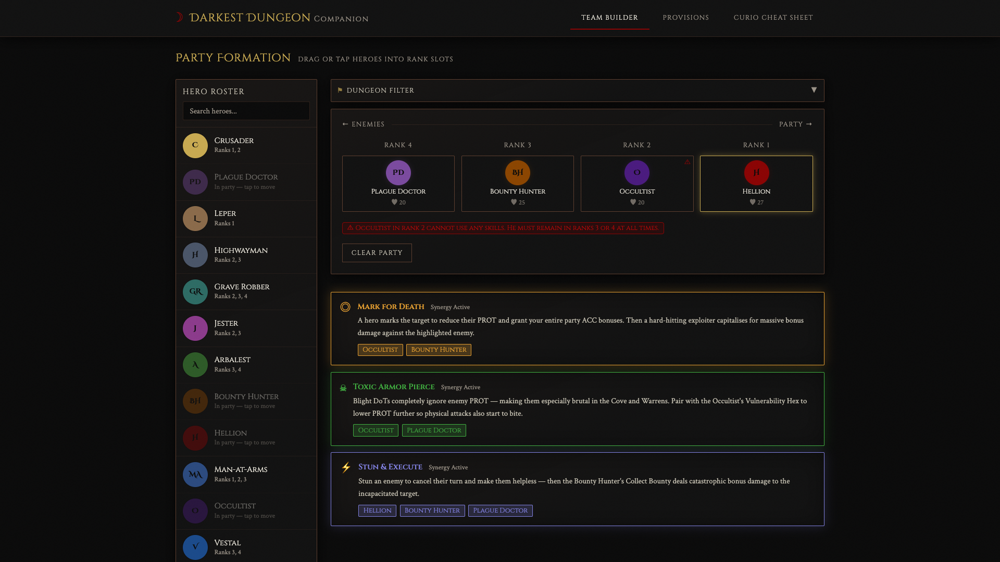
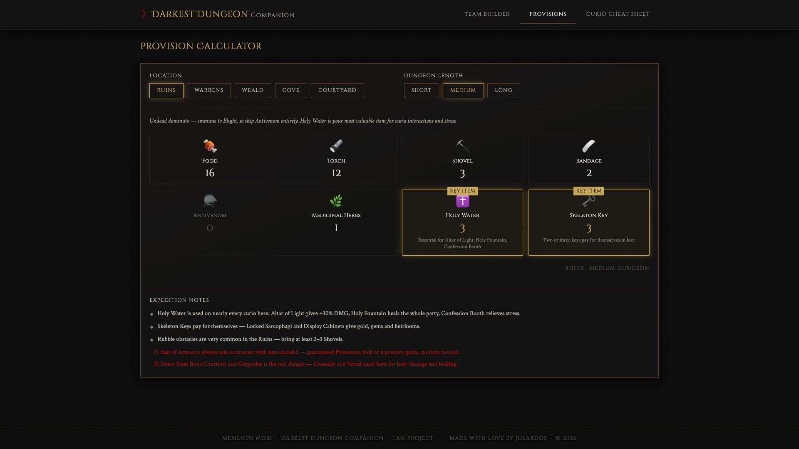

# Darkest Dungeon Companion

A fan-made reference tool for **Darkest Dungeon 1** — team builder, provision calculator, and curio cheat sheet in one SPA.

> Not affiliated with Red Hook Studios.

---

## Team Builder

Build your party of 4 and get instant feedback. The app detects active synergies (Mark for Death, Hemorrhage, Blight + Pierce, Stun & Execute) and explains why each combo works. Drag on desktop, tap on mobile. Slots glow green / amber / red as you drag to show optimal rank placements. Select a dungeon to highlight recommended heroes in gold and fade out ineffective ones.



## Provision Calculator

Pick a dungeon and expedition length — get a community-researched loadout with the right quantities for food, torches, shovels, bandages, antivenom, herbs, holy water, and keys. KEY ITEM badges call out the most critical provisions per dungeon, and Expedition Notes explain exactly which curios to prioritise and which item interactions to watch out for.



## Curio Cheat Sheet

55 curios sourced from the official wiki, organised by dungeon. Every card shows the safe item to use and what happens if you interact bare-handed. Includes danger warnings for the ones that punish the wrong item (Bas-Relief, Occult Scrawlings, Shambler's Altar). Filter by dungeon or search by name.


---

## Getting Started

**Prerequisites:** PHP 8.2+, Composer, Node 18+

```bash
git clone git@github.com:julardos/Darkest-Dungeon-Companion.git
cd Darkest-Dungeon-Companion

# Backend
cd backend && composer install && cp .env.example .env && php artisan key:generate && php artisan serve --port=8000

# Frontend (new terminal)
cd frontend && npm install && npm run dev
```

Open [http://localhost:3000](http://localhost:3000). The dev server proxies `/api` to Laravel automatically.

---

## Contributing

PRs welcome. Open areas:

- DLC heroes (Shieldbreaker, Antiquarian)
- Darkest Dungeon mission provision loadouts
- Trinket database
- Boss quick-reference cards
- Data corrections — open an issue if anything is wrong

[Open an issue](https://github.com/julardos/Darkest-Dungeon-Companion/issues) · MIT License · Made with love by **JulardoS**
