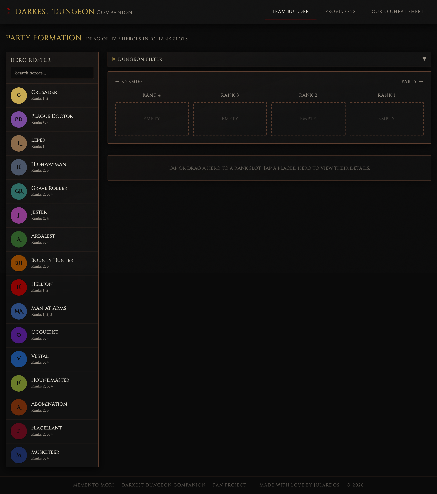
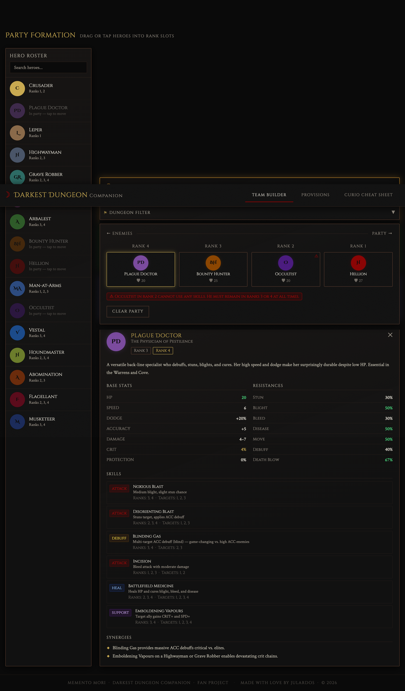
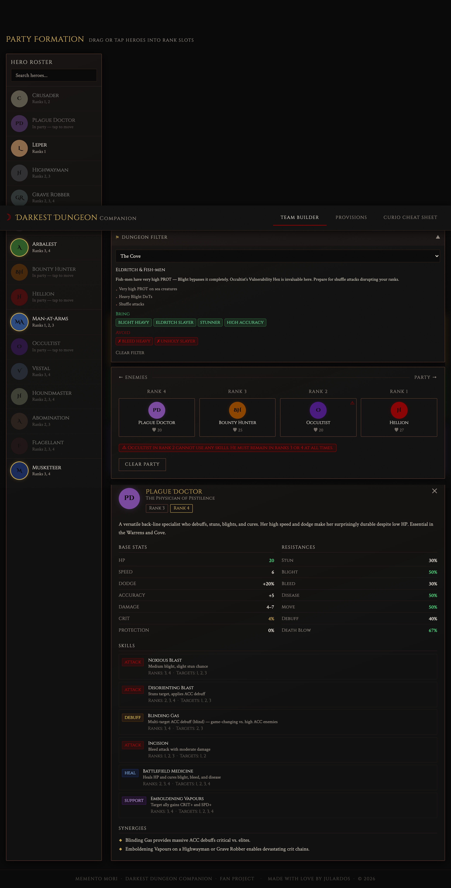
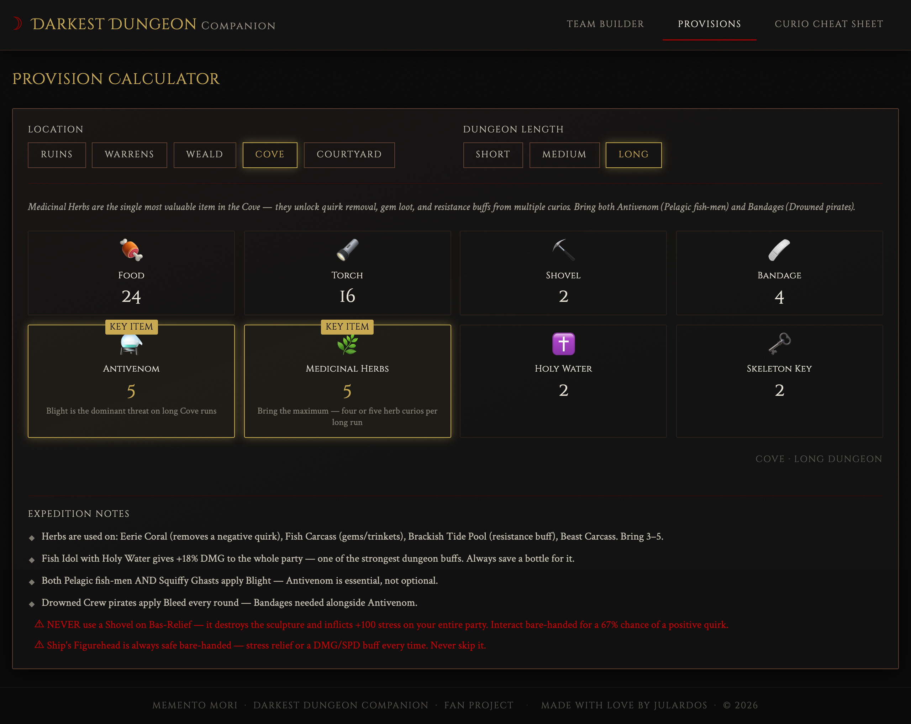
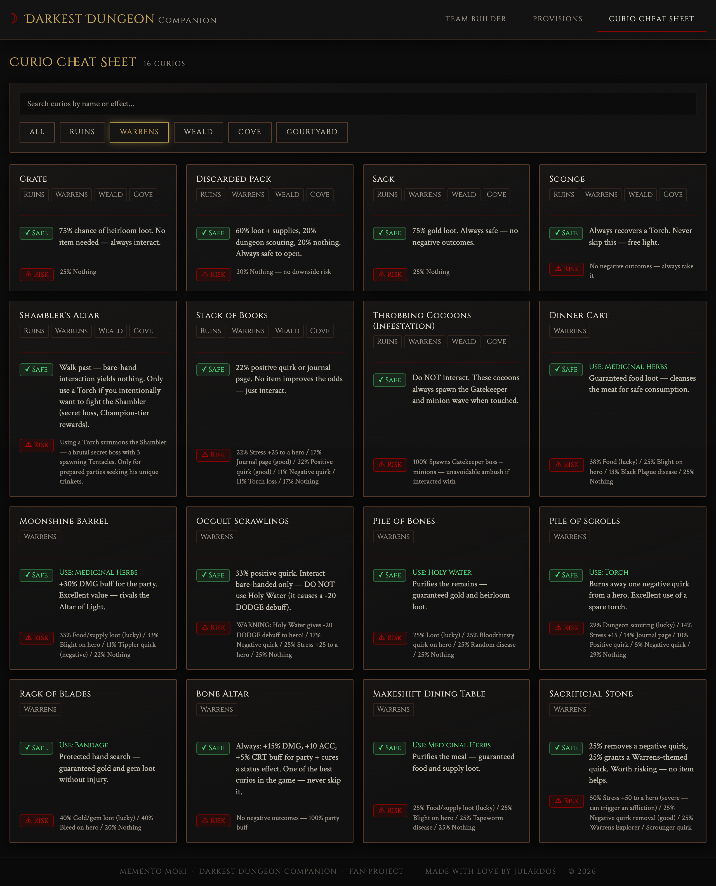
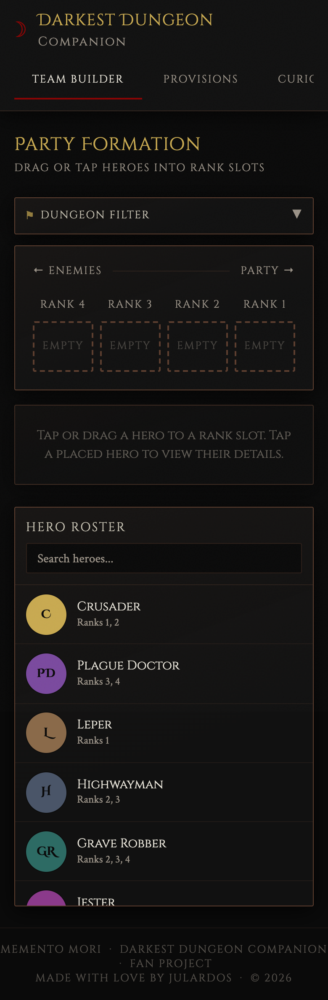

# Darkest Dungeon Companion

A fan-made reference companion web app for **Darkest Dungeon (the first game)**. Built with Vue 3 + Laravel 13 to help new and returning players with team composition, provisioning, and curio interactions.

> Fan project — not affiliated with Red Hook Studios.

---

## Features

### 🗡️ Team Builder

Drag (desktop) or tap (mobile) heroes into rank slots to build your party. The app analyses your composition in real time and surfaces:

- **Synergy Engine** — detects active mechanic combos (Mark for Death, Hemorrhage, Toxic Pierce, Stun & Execute) and explains *why* they work together
- **Rank Heatmap** — slots glow green / amber / red as you drag to show optimal rank placements
- **Dungeon Filter** — select a dungeon to highlight optimal heroes in gold and grey-out ineffective ones
- **Composition Warnings** — flags a missing healer or stress healer before you head in
- **Religious Conflict Checker** — warns when Abomination is partied with Vestal or Crusader








---

### 🎒 Provision Calculator

Select a dungeon and expedition length to get a community-researched provision loadout. Quantities are sourced from Steam guides, wiki data, and forum consensus.

- **KEY ITEM badges** highlight the most critical provisions per dungeon
- **Expedition Notes** explains *why* each item matters and which curios to prioritise
- Covers Ruins, Warrens, Weald, Cove, and Courtyard (Crimson Court DLC)




---

### 📜 Curio Cheat Sheet

55 curios sourced from the [Official Darkest Dungeon Wiki](https://darkestdungeon.wiki.gg/wiki/Curios), organised by dungeon with safe interaction advice for each one.

- Filter by dungeon or search by name / effect
- Each card shows the **safe item to use** and the **risk of interacting bare-handed**
- Includes critical danger warnings (e.g. never Shovel a Bas-Relief; never Holy Water Occult Scrawlings)




---

### 📱 Mobile Support

Fully responsive. On mobile the party formation appears above the hero roster so you can build your team without scrolling. Tap-to-select replaces drag-and-drop for touch screens — tap a hero to select them, then tap a rank slot to place or swap.




---

## Tech Stack

| Layer | Technology |
|-------|-----------|
| Frontend | Vue 3 (Composition API), Vite, Tailwind CSS |
| Backend | Laravel 13, PHP 8.5 |
| Fonts | Cinzel Decorative, Cinzel, Crimson Text (Google Fonts) |
| Data | Static PHP arrays — no database required |

---

## Getting Started

### Prerequisites

- PHP 8.2+
- Composer 2.x
- Node.js 18+
- npm

### Installation

```bash
git clone git@github.com:julardos/Darkest-Dungeon-Companion.git
cd Darkest-Dungeon-Companion
```

**Backend**

```bash
cd backend
composer install
cp .env.example .env
php artisan key:generate
php artisan serve --port=8000
```

**Frontend** (new terminal)

```bash
cd frontend
npm install
npm run dev
```

Open [http://localhost:3000](http://localhost:3000). The Vite dev server proxies all `/api` calls to Laravel automatically — no CORS config needed.

### Access on the same network

The dev server binds to `0.0.0.0` by default. The **Network** URL printed in the terminal (e.g. `http://192.168.x.x:3000`) works on any device on the same Wi-Fi.

---

## Project Structure

```
├── backend/
│   ├── app/Http/Controllers/
│   │   ├── HeroController.php         # 16 hero classes — stats, skills, resistances
│   │   ├── ProvisionController.php    # 5 dungeons × 3 lengths + community tips
│   │   └── CurioController.php        # 55 curios with safe/risk data
│   └── routes/api.php
│
├── frontend/
│   └── src/
│       ├── components/
│       │   ├── HeroBuilder.vue           # Party formation page (orchestrator)
│       │   ├── HeroRoster.vue            # Draggable / tappable hero list
│       │   ├── RankSlot.vue              # Rank slot with heatmap & tap support
│       │   ├── TeamSynergyPanel.vue      # Active synergy cards
│       │   ├── DungeonRecommender.vue    # Dungeon filter dropdown
│       │   ├── HeroDetailPanel.vue       # Full hero stats, skills, resistances
│       │   ├── ProvisionCalculator.vue   # Provision loadout + expedition notes
│       │   ├── CurioDatabase.vue         # Curio list with search + filters
│       │   └── CurioCard.vue             # Individual curio card
│       ├── composables/
│       │   └── useSynergyEngine.js       # Reactive synergy detection logic
│       └── data/
│           └── gameData.js               # Hero tags, synergy archetypes, dungeons
│
└── docs/screenshots/                     # README screenshots
```

---

## API Reference

| Method | Endpoint | Description |
|--------|----------|-------------|
| `GET` | `/api/health` | Health check |
| `GET` | `/api/heroes` | All 16 hero classes with full stats and skills |
| `GET` | `/api/provisions?location=ruins&length=medium` | Provision loadout for a dungeon + length |
| `GET` | `/api/curios` | All 55 curios with safe/risk interactions |

Valid `location` values: `ruins` · `warrens` · `weald` · `cove` · `courtyard`

Valid `length` values: `short` · `medium` · `long`

---

## Contributing

Contributions are welcome! This is a community reference tool — accuracy and completeness depend on the community catching what I miss.

### How to contribute

1. **Fork** the repository
2. **Create a branch** — `git checkout -b feature/your-feature-name`
3. **Make your changes** and test locally
4. **Open a Pull Request** — describe what changed and why

### Ideas & open tasks

- [ ] **DLC heroes** — Shieldbreaker and Antiquarian need full skill and stat data
- [ ] **Darkest Dungeon missions** — provision recommendations for all 4 DD mission types
- [ ] **Trinket database** — cheat sheet for trinkets by hero and dungeon
- [ ] **Boss reference** — quick cards per boss (weaknesses, dangerous skills, positioning)
- [ ] **Camping skills guide** — best camp skills per party composition
- [ ] **Data corrections** — spotted a wrong curio effect, wrong provision count, or missing hero detail? Please open a PR or issue

### Reporting issues

Open an [issue](https://github.com/julardos/Darkest-Dungeon-Companion/issues) with:
- What you expected to see
- What actually happened
- A screenshot if relevant

---

## Data Sources

- [Official Darkest Dungeon Wiki](https://darkestdungeon.wiki.gg/wiki/Curios) — curio data and mechanics
- [Steam Community Guides](https://steamcommunity.com/app/262060/guides/) — provisioning recommendations
- [Darkest Dungeon Fandom Wiki](https://darkestdungeon.fandom.com/) — supplementary reference

---

## License

MIT — free to use, fork, and build on.

---

<p align="center">Made with love by <strong>JulardoS</strong> &nbsp;·&nbsp; Memento Mori</p>
